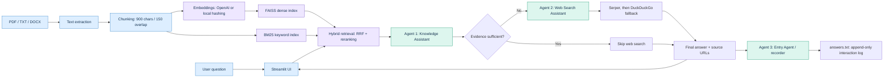

# Architecture diagram source

Paste this Mermaid into GitHub Markdown or a Mermaid editor to render the editable diagram. The repository also includes `architecture.png`.

```mermaid
flowchart LR
  U[User question] --> UI[Streamlit UI]
  D[PDF / TXT / DOCX] --> X[Text extraction]
  X --> C[Chunking: 900 chars / 150 overlap]
  C --> E[Embeddings: OpenAI or local hashing]
  E --> F[FAISS dense index]
  C --> B[BM25 keyword index]
  F --> R[Hybrid retrieval: RRF + reranking]
  B --> R
  UI --> R
  R --> K[Agent 1: Knowledge Assistant]
  K --> Q{Evidence sufficient?}
  Q -- Yes --> S[Skip web search]
  Q -- No --> W[Agent 2: Web Search Assistant]
  W --> WS[Serper, then DuckDuckGo fallback]
  WS --> A[Final answer + source URLs]
  S --> A
  A --> L[Agent 3: Entry Agent / recorder]
  L --> LOG[answers.txt: append-only interaction log]
  A --> UI
  classDef input fill:#DDEEFF,stroke:#3683C7,color:#15324F
  classDef rag fill:#EEE7FF,stroke:#8063C8,color:#15324F
  classDef agent fill:#DDF6EE,stroke:#159570,color:#15324F
  class U,UI,D,X,C input
  class E,F,B,R rag
  class K,W,L agent
```
